# Dwarves

Dwarves is a browser based idle game, where users build a team of dwarves to mine various minerals.
These minerals can be used to upgrade each dwarf, allowing for faster mining and more upgrading.

Dwarves is in essence a very simple game that does not require any active elements or live updating of webpages.
The game will however require large scale databases to store different users, dwarves and upgrades.
This makes it suitable to work with the Django webframework and make use of the models that Django provides.

There are already a ton of idle games out there, cookie clicker, forager, melvor idle or even social games like clash of clans.
One thing that Dwarves aims to do is add some simple social elements like a leaderboard, the ability to view other players dwarves and maybe the ability to trade minerals.
On top of that Dwarves should remain a simple game, without it getting bloated by a ton of different options and gameplay elements.

The hardest parts of this project will probaply be:
<ul>
  <li>Fitting every stat and piece of information about the different dwarves and mines on the webpages in a clear view.</li>
  <li>Creating a compelling game without live updating the browser.</li>
  <li>Making the interface user friendly without the use of live updating.</li>
</ul> 

# Sketches

To get a general idea of what the webpages will look like some quick sketches where made.
These sketches also include a trading which is an additional feature that probaply wont be added so in future designs this page will not be present.
Check the design portion for a more detailed overview of the pages.

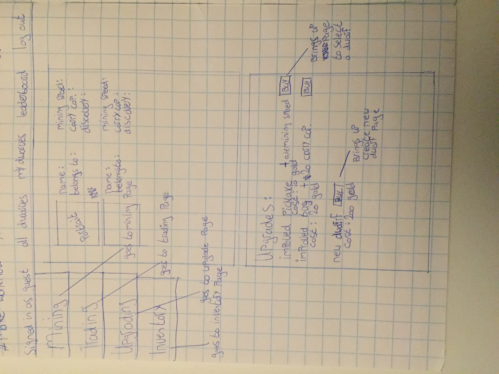

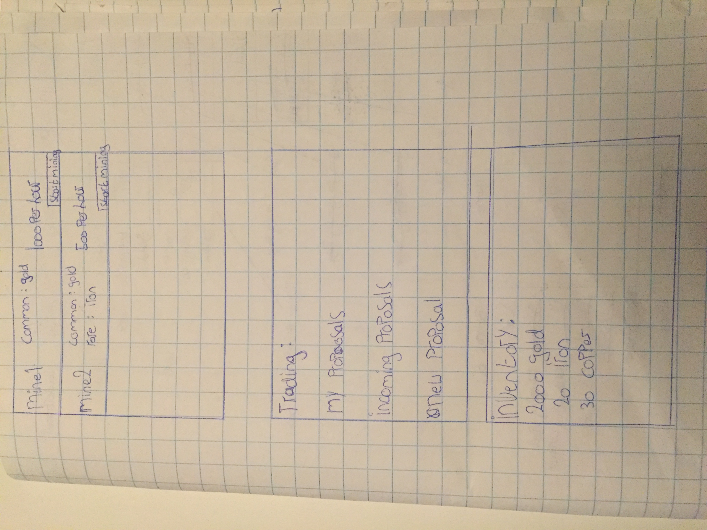

# External Components 

On top of using the Django webframework and the Django model classes.
The project will also make use of some bootstrap elements, in specific it will use:
<ul>
  <li>alerts, as messages to inform to user of wrong input</li>
  <li>containers or a grid, to align all the different elements</li>
  <li>a navigation bar to go to different pages</li>
</ul> 

# Design

Every page on the site will make use of a standard navigation bar, so from every page it is possible to go to almost every other page.
This is one of the reasons why this design document wont feature a workflow, because it just would not be very insightful.
All these pages will asume that the user is logged in. T
he login page and the register page will be default Django pages with maybe a color change to match the other pages.
When the user is not logged in, the tabs mining, upgrading, inventory and my dwarves will all be hidden and unavailable.

### All dwarves page
This is the homepage of the website and allows people to view all the different dwarves and their stats.

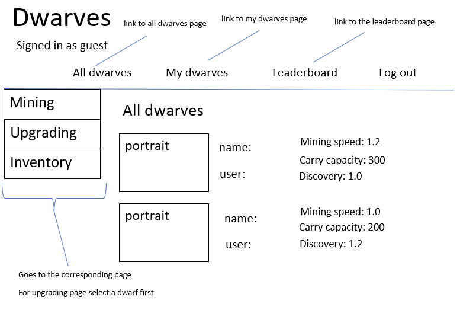

### My dwarves page
This page will allow users to only see the dwarves that belong to them.

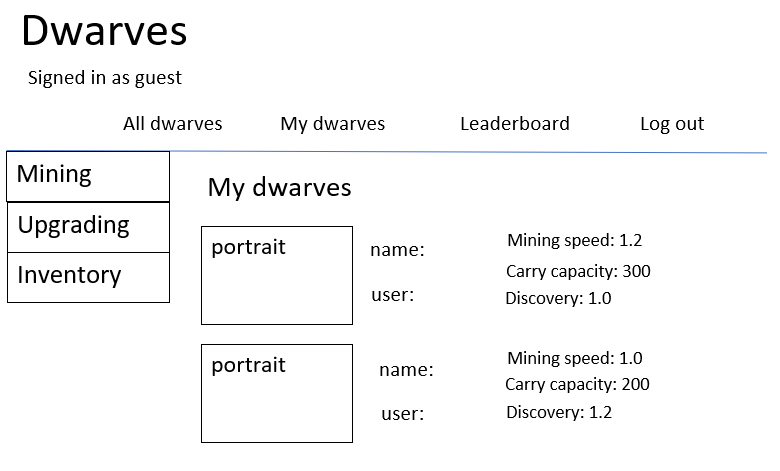

### Leaderboard page
This page will allow people to view a leaderboard of users based on the amount of gold in each players inventory.

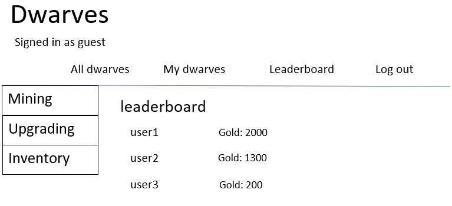

### Inventory page
This page will allow users to view the minerals they own, gold being the most important one.

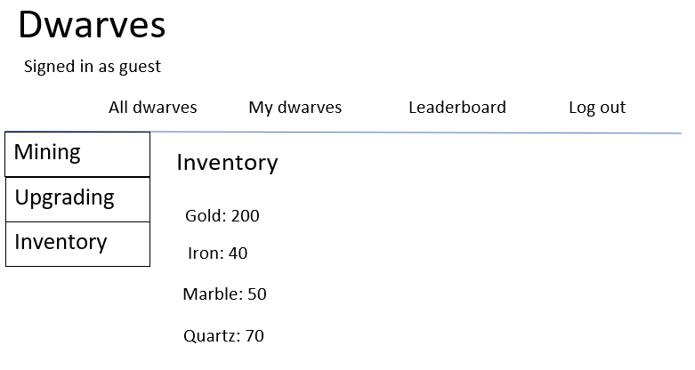

### Mining page
This will allow users to view all available mines, the resources in those mines and the droprate.
When a dwarf is currently mining in a mine, it will show the time it takes for their bag to be filled aswell as an option to remove the dwarf from mining.
The user can only see their own dwarf in the mining page, so two users can mine in the same mine at the same time.
When a mine is not occupied, the user can press the start mining button and will be taken to a selection of available dwarfs on the selection page.

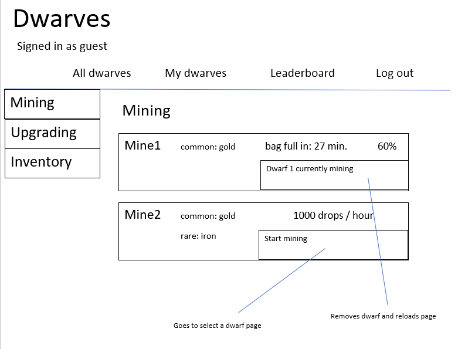

### Selection page
This page will allow users to select a dwarf to either upgrade or start mining.

### Upgrading page
Before the user goes to the upgrading page they will be taken to the selection page to select a dwarf to upgrade.
Upgrades can be bought multiple times and will increase in price each time.
The prices are unique per dwarf so when selecting a dwarf the prices will match that.
The price of the new dwarf upgrade will increase based on the amount of dwarves the user already has.
The user can choose a name for their new dwarf and a portrait will be chosen at random.

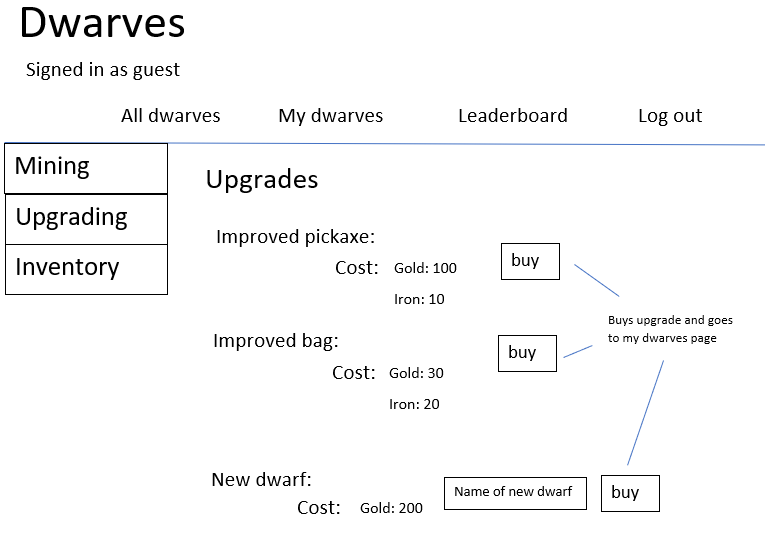

### Dwarven portraits
When a new dwarf is created a portrait will be chosen at random, each portrait will use the same base except for the colors

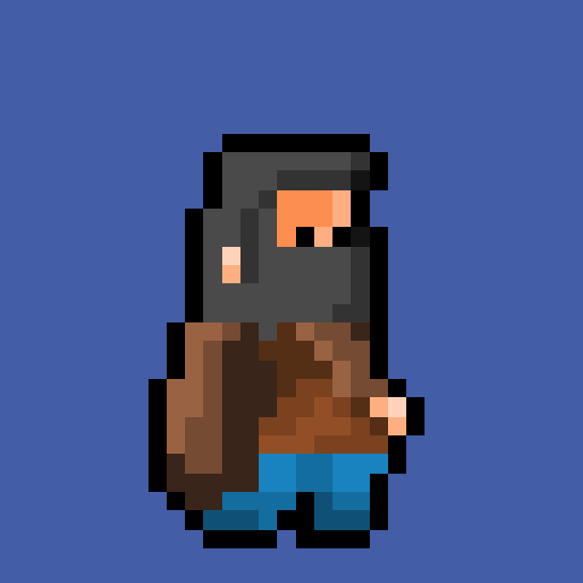

# The Database

With the current design the amount of models the site uses will be seven.
For a better overview, the models can be split into three different types.

### User & Dwarves
The user model will be a standard user model that Django provides with one extra field for the inventory.
The inventory has a many to many relationship with a mineral which also has a name and a value.
For each dwarf the a user will be stored aswell as some stats and the mine that dwarf is currentyl working in.

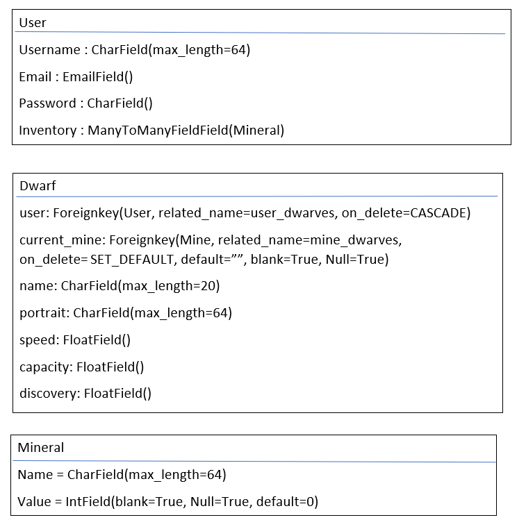

### Mines
The mines will use two databases, one to store information about the mine and one to store information about the minerals inside the mine.
Each mine also has a requirement, wich is the amount of dwarves necesarry to be able to enter this mine.
The rarity of each mineral determines the chances of getting that mineral with each drop.

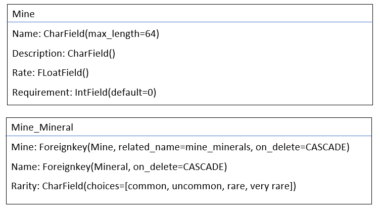

### Upgrade
The upgrades will use two databases, one to store information about the upgrade the other to store information about the upgrades each dwarf has.
The prices shown of the upgrades will change based on the number of times a dwarf has bought that upgrade.

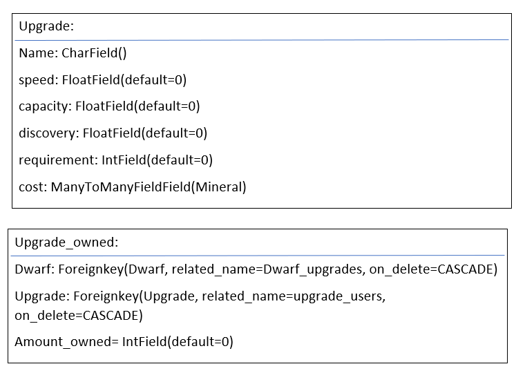

