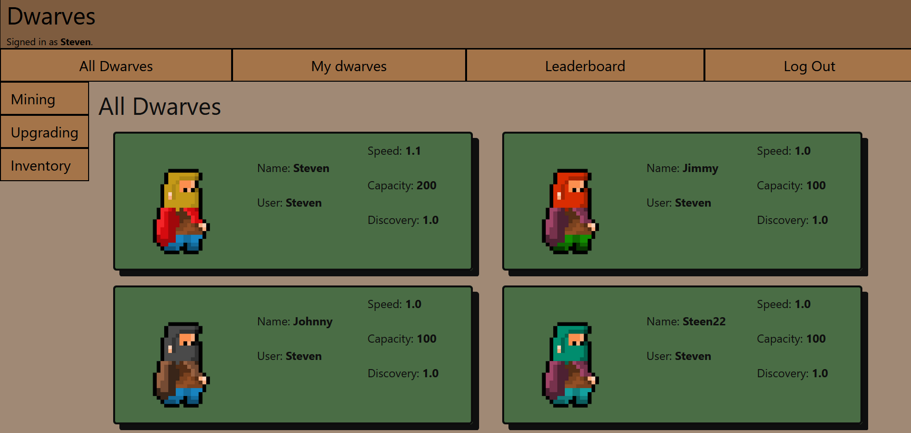
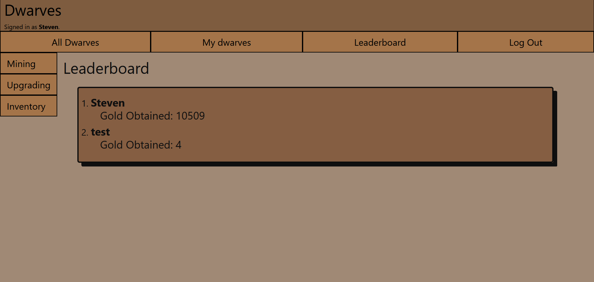
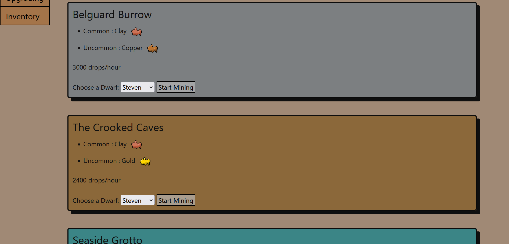
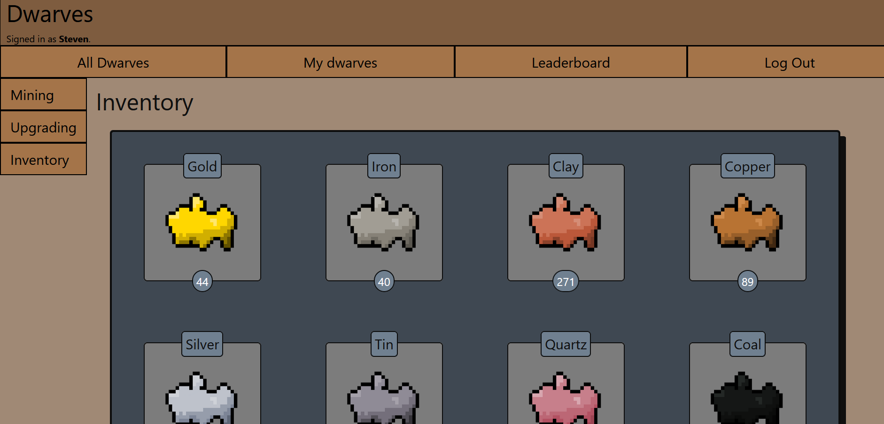
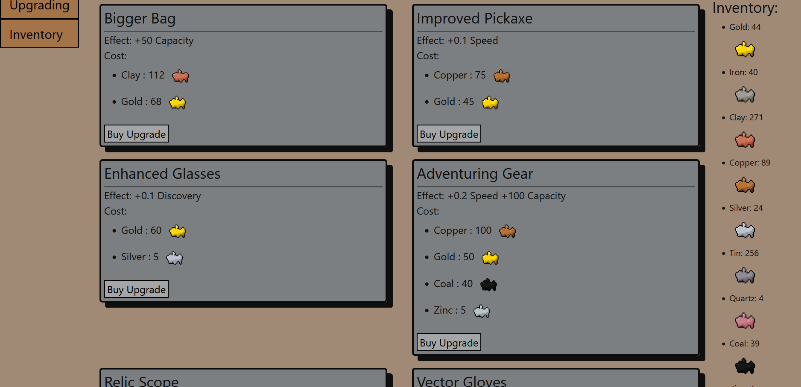
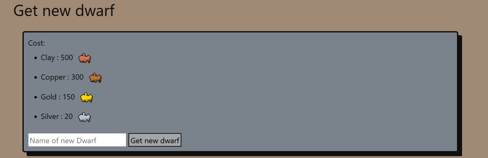
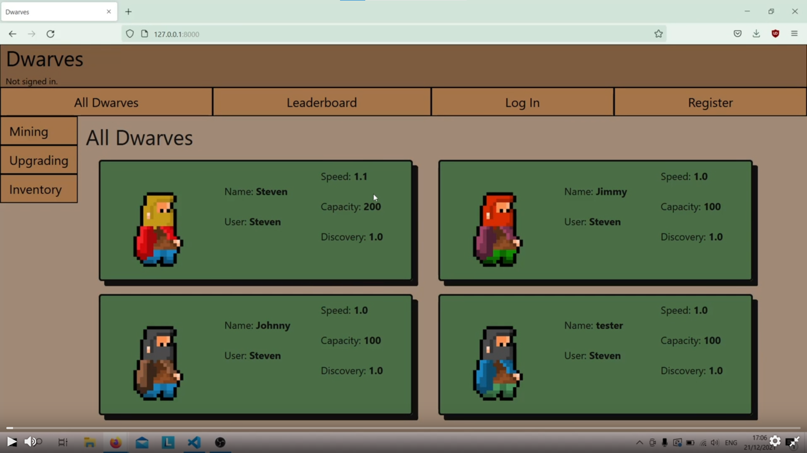

# Dwarves
##### by Steven Nederend
##### 2021 All rights reserved

Dwarves is a browser based idle game, where players can build a team of dwarves to mine various minerals.
These minerals can be used to purchase upgrades for each dwarf, allowing for faster mining and thus more upgrading.
More upgrades and mines will unlock for the player as they progress throughout the game with a total of thirteen mines to unlock and twelve different upgrades to unlock.
There is also a leaderboard feature allowing players to test their dwarves against eachother.

## Register

To start playing Dwarves you have to register an account, after registration your first dwarf will be created automatically with your username, making you the first dwarf in your colony. after registration you will be taken to the dwarves page.

## Dwarves page

The dwarves page is the homepage of the site, here you can view all dwarves, including the dwarves from other players.
If you want to view only your own dwarves, you can go visit the my dwarves page instead.

## Leaderboard

The leaderboard page shows a ranking of every player.
The ranking is based on the total amount of gold earned because gold is going to be the most important resource.

## Mining

Head over to the mining page to start mining and earn resources.
You can assign a single dwarf to a single mine, after waiting for a short time you can collect the resources your dwarf has mined.
The drops/hour and the dwarfs speed determine how fast a dwarf mines, A dwarfs capacity determines how many drops they can carry and their discovery determines how likely they are to find rare minerals.

## Inventory

When viewing the inventory page you get a large overview of every resource you currently possess.

## Upgrading

In the upgrading page you can upgrade your dwarves. Before upgrading you will have to select a dwarf to upgrade. 
Each upgrade has its own unique cost, see the inventory at the side of the page to quickly check if you have enough resources for an upgrade.

At the bottom of the upgrade page is the get a new dwarf upgrade, here users can add dwarves to their colony, for a hefty price.

# Demo

